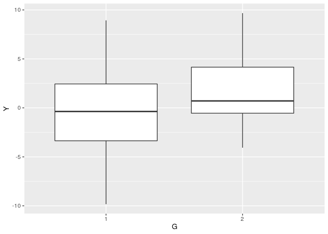

Practice 4
================

Data import and preprocess

``` r
set.seed(123)

N1 <- 30
N2 <- 20
Y1 <- rnorm(n=N1, mean=0, sd=5)
Y2 <- rnorm(n=N2, mean=1, sd=4)

# Preprocess and visualize
d1 <- data.frame(Y=Y1, G=factor(1))
d2 <- data.frame(Y=Y2, G=factor(2))
d <- rbind(d1, d2)
```

## Visualize (Assignment 1)

``` r
d %>%
    ggplot(aes(y=Y, x=G)) +
    geom_boxplot()
```

<!-- -->

## Make a model (Assignment 2)

  - \(\mu[n] = b_1 + b_2 G[n]\) (transformed parameter)
  - \(Y[n] \gets Normal(\mu[n], \sigma)\)

## Make stan files and excute them (Assignment 3)

``` r
data <- list(N = nrow(d),
             G = as.numeric(d$G),
             Y = d$Y)
fit <- stan(file='model/practice-4-3.stan', data=data, seed=1234)
```

    ## 
    ## SAMPLING FOR MODEL 'practice-4-3' NOW (CHAIN 1).
    ## Chain 1: 
    ## Chain 1: Gradient evaluation took 3.2e-05 seconds
    ## Chain 1: 1000 transitions using 10 leapfrog steps per transition would take 0.32 seconds.
    ## Chain 1: Adjust your expectations accordingly!
    ## Chain 1: 
    ## Chain 1: 
    ## Chain 1: Iteration:    1 / 2000 [  0%]  (Warmup)
    ## Chain 1: Iteration:  200 / 2000 [ 10%]  (Warmup)
    ## Chain 1: Iteration:  400 / 2000 [ 20%]  (Warmup)
    ## Chain 1: Iteration:  600 / 2000 [ 30%]  (Warmup)
    ## Chain 1: Iteration:  800 / 2000 [ 40%]  (Warmup)
    ## Chain 1: Iteration: 1000 / 2000 [ 50%]  (Warmup)
    ## Chain 1: Iteration: 1001 / 2000 [ 50%]  (Sampling)
    ## Chain 1: Iteration: 1200 / 2000 [ 60%]  (Sampling)
    ## Chain 1: Iteration: 1400 / 2000 [ 70%]  (Sampling)
    ## Chain 1: Iteration: 1600 / 2000 [ 80%]  (Sampling)
    ## Chain 1: Iteration: 1800 / 2000 [ 90%]  (Sampling)
    ## Chain 1: Iteration: 2000 / 2000 [100%]  (Sampling)
    ## Chain 1: 
    ## Chain 1:  Elapsed Time: 0.113401 seconds (Warm-up)
    ## Chain 1:                0.093727 seconds (Sampling)
    ## Chain 1:                0.207128 seconds (Total)
    ## Chain 1: 
    ## 
    ## SAMPLING FOR MODEL 'practice-4-3' NOW (CHAIN 2).
    ## Chain 2: 
    ## Chain 2: Gradient evaluation took 8e-06 seconds
    ## Chain 2: 1000 transitions using 10 leapfrog steps per transition would take 0.08 seconds.
    ## Chain 2: Adjust your expectations accordingly!
    ## Chain 2: 
    ## Chain 2: 
    ## Chain 2: Iteration:    1 / 2000 [  0%]  (Warmup)
    ## Chain 2: Iteration:  200 / 2000 [ 10%]  (Warmup)
    ## Chain 2: Iteration:  400 / 2000 [ 20%]  (Warmup)
    ## Chain 2: Iteration:  600 / 2000 [ 30%]  (Warmup)
    ## Chain 2: Iteration:  800 / 2000 [ 40%]  (Warmup)
    ## Chain 2: Iteration: 1000 / 2000 [ 50%]  (Warmup)
    ## Chain 2: Iteration: 1001 / 2000 [ 50%]  (Sampling)
    ## Chain 2: Iteration: 1200 / 2000 [ 60%]  (Sampling)
    ## Chain 2: Iteration: 1400 / 2000 [ 70%]  (Sampling)
    ## Chain 2: Iteration: 1600 / 2000 [ 80%]  (Sampling)
    ## Chain 2: Iteration: 1800 / 2000 [ 90%]  (Sampling)
    ## Chain 2: Iteration: 2000 / 2000 [100%]  (Sampling)
    ## Chain 2: 
    ## Chain 2:  Elapsed Time: 0.108604 seconds (Warm-up)
    ## Chain 2:                0.091948 seconds (Sampling)
    ## Chain 2:                0.200552 seconds (Total)
    ## Chain 2: 
    ## 
    ## SAMPLING FOR MODEL 'practice-4-3' NOW (CHAIN 3).
    ## Chain 3: 
    ## Chain 3: Gradient evaluation took 9e-06 seconds
    ## Chain 3: 1000 transitions using 10 leapfrog steps per transition would take 0.09 seconds.
    ## Chain 3: Adjust your expectations accordingly!
    ## Chain 3: 
    ## Chain 3: 
    ## Chain 3: Iteration:    1 / 2000 [  0%]  (Warmup)
    ## Chain 3: Iteration:  200 / 2000 [ 10%]  (Warmup)
    ## Chain 3: Iteration:  400 / 2000 [ 20%]  (Warmup)
    ## Chain 3: Iteration:  600 / 2000 [ 30%]  (Warmup)
    ## Chain 3: Iteration:  800 / 2000 [ 40%]  (Warmup)
    ## Chain 3: Iteration: 1000 / 2000 [ 50%]  (Warmup)
    ## Chain 3: Iteration: 1001 / 2000 [ 50%]  (Sampling)
    ## Chain 3: Iteration: 1200 / 2000 [ 60%]  (Sampling)
    ## Chain 3: Iteration: 1400 / 2000 [ 70%]  (Sampling)
    ## Chain 3: Iteration: 1600 / 2000 [ 80%]  (Sampling)
    ## Chain 3: Iteration: 1800 / 2000 [ 90%]  (Sampling)
    ## Chain 3: Iteration: 2000 / 2000 [100%]  (Sampling)
    ## Chain 3: 
    ## Chain 3:  Elapsed Time: 0.116017 seconds (Warm-up)
    ## Chain 3:                0.122376 seconds (Sampling)
    ## Chain 3:                0.238393 seconds (Total)
    ## Chain 3: 
    ## 
    ## SAMPLING FOR MODEL 'practice-4-3' NOW (CHAIN 4).
    ## Chain 4: 
    ## Chain 4: Gradient evaluation took 1e-05 seconds
    ## Chain 4: 1000 transitions using 10 leapfrog steps per transition would take 0.1 seconds.
    ## Chain 4: Adjust your expectations accordingly!
    ## Chain 4: 
    ## Chain 4: 
    ## Chain 4: Iteration:    1 / 2000 [  0%]  (Warmup)
    ## Chain 4: Iteration:  200 / 2000 [ 10%]  (Warmup)
    ## Chain 4: Iteration:  400 / 2000 [ 20%]  (Warmup)
    ## Chain 4: Iteration:  600 / 2000 [ 30%]  (Warmup)
    ## Chain 4: Iteration:  800 / 2000 [ 40%]  (Warmup)
    ## Chain 4: Iteration: 1000 / 2000 [ 50%]  (Warmup)
    ## Chain 4: Iteration: 1001 / 2000 [ 50%]  (Sampling)
    ## Chain 4: Iteration: 1200 / 2000 [ 60%]  (Sampling)
    ## Chain 4: Iteration: 1400 / 2000 [ 70%]  (Sampling)
    ## Chain 4: Iteration: 1600 / 2000 [ 80%]  (Sampling)
    ## Chain 4: Iteration: 1800 / 2000 [ 90%]  (Sampling)
    ## Chain 4: Iteration: 2000 / 2000 [100%]  (Sampling)
    ## Chain 4: 
    ## Chain 4:  Elapsed Time: 0.105552 seconds (Warm-up)
    ## Chain 4:                0.116681 seconds (Sampling)
    ## Chain 4:                0.222233 seconds (Total)
    ## Chain 4:

``` r
save.image(file="output/practice-4-3.RData")
summary(fit)$summary[c("b1","b2","sigma"),]
```

    ##            mean    se_mean       sd       2.5%       25%       50%
    ## b1    -2.116476 0.04510298 1.874829 -5.8010503 -3.363345 -2.119584
    ## b2     1.868301 0.03053757 1.266500 -0.7157614  1.024242  1.867827
    ## sigma  4.468398 0.01051197 0.466677  3.6525294  4.135968  4.441475
    ##              75%    97.5%    n_eff      Rhat
    ## b1    -0.8764343 1.658309 1727.877 1.0009525
    ## b2     2.7129479 4.337936 1720.052 1.0016029
    ## sigma  4.7564849 5.475842 1970.900 0.9998646

## Culculate P(mu\_1 \< mu\_2) (Assignment 4)

``` r
# fit
load("output/practice-4-3.RData")

# mcmc sample
ms <- rstan::extract(fit)
# calculate
mu_1 <- ms$b1 + ms$b2 * 1
mu_2 <- ms$b1 + ms$b2 * 2

# count n of T
length(mu_1)
```

    ## [1] 4000

``` r
sum(mu_1 < mean(mu_2))/length(mu_1)
```

    ## [1] 0.9865

## different sigma (Assignment 5)

``` r
data.2 <- list(N = nrow(d),
             G = as.numeric(d$G),
             Y = d$Y)
fit.2 <- stan(file='model/practice-4-5.stan', data=data.2, seed=1234)
```

    ## 
    ## SAMPLING FOR MODEL 'practice-4-5' NOW (CHAIN 1).
    ## Chain 1: 
    ## Chain 1: Gradient evaluation took 2.2e-05 seconds
    ## Chain 1: 1000 transitions using 10 leapfrog steps per transition would take 0.22 seconds.
    ## Chain 1: Adjust your expectations accordingly!
    ## Chain 1: 
    ## Chain 1: 
    ## Chain 1: Iteration:    1 / 2000 [  0%]  (Warmup)
    ## Chain 1: Iteration:  200 / 2000 [ 10%]  (Warmup)
    ## Chain 1: Iteration:  400 / 2000 [ 20%]  (Warmup)
    ## Chain 1: Iteration:  600 / 2000 [ 30%]  (Warmup)
    ## Chain 1: Iteration:  800 / 2000 [ 40%]  (Warmup)
    ## Chain 1: Iteration: 1000 / 2000 [ 50%]  (Warmup)
    ## Chain 1: Iteration: 1001 / 2000 [ 50%]  (Sampling)
    ## Chain 1: Iteration: 1200 / 2000 [ 60%]  (Sampling)
    ## Chain 1: Iteration: 1400 / 2000 [ 70%]  (Sampling)
    ## Chain 1: Iteration: 1600 / 2000 [ 80%]  (Sampling)
    ## Chain 1: Iteration: 1800 / 2000 [ 90%]  (Sampling)
    ## Chain 1: Iteration: 2000 / 2000 [100%]  (Sampling)
    ## Chain 1: 
    ## Chain 1:  Elapsed Time: 0.275759 seconds (Warm-up)
    ## Chain 1:                0.168337 seconds (Sampling)
    ## Chain 1:                0.444096 seconds (Total)
    ## Chain 1: 
    ## 
    ## SAMPLING FOR MODEL 'practice-4-5' NOW (CHAIN 2).
    ## Chain 2: 
    ## Chain 2: Gradient evaluation took 2.1e-05 seconds
    ## Chain 2: 1000 transitions using 10 leapfrog steps per transition would take 0.21 seconds.
    ## Chain 2: Adjust your expectations accordingly!
    ## Chain 2: 
    ## Chain 2: 
    ## Chain 2: Iteration:    1 / 2000 [  0%]  (Warmup)
    ## Chain 2: Iteration:  200 / 2000 [ 10%]  (Warmup)
    ## Chain 2: Iteration:  400 / 2000 [ 20%]  (Warmup)
    ## Chain 2: Iteration:  600 / 2000 [ 30%]  (Warmup)
    ## Chain 2: Iteration:  800 / 2000 [ 40%]  (Warmup)
    ## Chain 2: Iteration: 1000 / 2000 [ 50%]  (Warmup)
    ## Chain 2: Iteration: 1001 / 2000 [ 50%]  (Sampling)
    ## Chain 2: Iteration: 1200 / 2000 [ 60%]  (Sampling)
    ## Chain 2: Iteration: 1400 / 2000 [ 70%]  (Sampling)
    ## Chain 2: Iteration: 1600 / 2000 [ 80%]  (Sampling)
    ## Chain 2: Iteration: 1800 / 2000 [ 90%]  (Sampling)
    ## Chain 2: Iteration: 2000 / 2000 [100%]  (Sampling)
    ## Chain 2: 
    ## Chain 2:  Elapsed Time: 0.193761 seconds (Warm-up)
    ## Chain 2:                0.203709 seconds (Sampling)
    ## Chain 2:                0.39747 seconds (Total)
    ## Chain 2: 
    ## 
    ## SAMPLING FOR MODEL 'practice-4-5' NOW (CHAIN 3).
    ## Chain 3: Rejecting initial value:
    ## Chain 3:   Error evaluating the log probability at the initial value.
    ## Chain 3: Exception: validate transformed params: sigma[i_0__] is -3.06927, but must be greater than or equal to 0  (in 'model4b8321db0ea1_practice_4_5' at line 17)
    ## 
    ## Chain 3: Rejecting initial value:
    ## Chain 3:   Error evaluating the log probability at the initial value.
    ## Chain 3: Exception: validate transformed params: sigma[i_0__] is -1.19315, but must be greater than or equal to 0  (in 'model4b8321db0ea1_practice_4_5' at line 17)
    ## 
    ## Chain 3: Rejecting initial value:
    ## Chain 3:   Error evaluating the log probability at the initial value.
    ## Chain 3: Exception: validate transformed params: sigma[i_0__] is -1.33642, but must be greater than or equal to 0  (in 'model4b8321db0ea1_practice_4_5' at line 17)
    ## 
    ## Chain 3: Rejecting initial value:
    ## Chain 3:   Error evaluating the log probability at the initial value.
    ## Chain 3: Exception: validate transformed params: sigma[i_0__] is -1.76515, but must be greater than or equal to 0  (in 'model4b8321db0ea1_practice_4_5' at line 17)
    ## 
    ## Chain 3: Rejecting initial value:
    ## Chain 3:   Error evaluating the log probability at the initial value.
    ## Chain 3: Exception: validate transformed params: sigma[i_0__] is -2.67875, but must be greater than or equal to 0  (in 'model4b8321db0ea1_practice_4_5' at line 17)
    ## 
    ## Chain 3: Rejecting initial value:
    ## Chain 3:   Error evaluating the log probability at the initial value.
    ## Chain 3: Exception: validate transformed params: sigma[i_0__] is -0.260764, but must be greater than or equal to 0  (in 'model4b8321db0ea1_practice_4_5' at line 17)
    ## 
    ## Chain 3: 
    ## Chain 3: Gradient evaluation took 1.2e-05 seconds
    ## Chain 3: 1000 transitions using 10 leapfrog steps per transition would take 0.12 seconds.
    ## Chain 3: Adjust your expectations accordingly!
    ## Chain 3: 
    ## Chain 3: 
    ## Chain 3: Iteration:    1 / 2000 [  0%]  (Warmup)
    ## Chain 3: Iteration:  200 / 2000 [ 10%]  (Warmup)
    ## Chain 3: Iteration:  400 / 2000 [ 20%]  (Warmup)
    ## Chain 3: Iteration:  600 / 2000 [ 30%]  (Warmup)
    ## Chain 3: Iteration:  800 / 2000 [ 40%]  (Warmup)
    ## Chain 3: Iteration: 1000 / 2000 [ 50%]  (Warmup)
    ## Chain 3: Iteration: 1001 / 2000 [ 50%]  (Sampling)
    ## Chain 3: Iteration: 1200 / 2000 [ 60%]  (Sampling)
    ## Chain 3: Iteration: 1400 / 2000 [ 70%]  (Sampling)
    ## Chain 3: Iteration: 1600 / 2000 [ 80%]  (Sampling)
    ## Chain 3: Iteration: 1800 / 2000 [ 90%]  (Sampling)
    ## Chain 3: Iteration: 2000 / 2000 [100%]  (Sampling)
    ## Chain 3: 
    ## Chain 3:  Elapsed Time: 0.183776 seconds (Warm-up)
    ## Chain 3:                0.178148 seconds (Sampling)
    ## Chain 3:                0.361924 seconds (Total)
    ## Chain 3: 
    ## 
    ## SAMPLING FOR MODEL 'practice-4-5' NOW (CHAIN 4).
    ## Chain 4: 
    ## Chain 4: Gradient evaluation took 1.2e-05 seconds
    ## Chain 4: 1000 transitions using 10 leapfrog steps per transition would take 0.12 seconds.
    ## Chain 4: Adjust your expectations accordingly!
    ## Chain 4: 
    ## Chain 4: 
    ## Chain 4: Iteration:    1 / 2000 [  0%]  (Warmup)
    ## Chain 4: Iteration:  200 / 2000 [ 10%]  (Warmup)
    ## Chain 4: Iteration:  400 / 2000 [ 20%]  (Warmup)
    ## Chain 4: Iteration:  600 / 2000 [ 30%]  (Warmup)
    ## Chain 4: Iteration:  800 / 2000 [ 40%]  (Warmup)
    ## Chain 4: Iteration: 1000 / 2000 [ 50%]  (Warmup)
    ## Chain 4: Iteration: 1001 / 2000 [ 50%]  (Sampling)
    ## Chain 4: Iteration: 1200 / 2000 [ 60%]  (Sampling)
    ## Chain 4: Iteration: 1400 / 2000 [ 70%]  (Sampling)
    ## Chain 4: Iteration: 1600 / 2000 [ 80%]  (Sampling)
    ## Chain 4: Iteration: 1800 / 2000 [ 90%]  (Sampling)
    ## Chain 4: Iteration: 2000 / 2000 [100%]  (Sampling)
    ## Chain 4: 
    ## Chain 4:  Elapsed Time: 0.196345 seconds (Warm-up)
    ## Chain 4:                0.181365 seconds (Sampling)
    ## Chain 4:                0.37771 seconds (Total)
    ## Chain 4:

``` r
save.image(file="output/practice-4-5.RData")
summary(fit.2)$summary[c("b1","b2","b3","b4"),]
```

    ##         mean    se_mean        sd       2.5%       25%       50%
    ## b1 -2.132766 0.05248610 2.0354743 -6.1857808 -3.470973 -2.100401
    ## b2  1.887804 0.03246292 1.2392073 -0.4219083  1.032241  1.866744
    ## b3  6.646206 0.04122927 1.5652147  3.7827630  5.553741  6.536904
    ## b4 -1.504662 0.02574956 0.9609716 -3.3672140 -2.139050 -1.528341
    ##           75%     97.5%    n_eff     Rhat
    ## b1 -0.7284505 1.7464711 1503.982 1.001074
    ## b2  2.7348894 4.3785858 1457.179 1.001721
    ## b3  7.6843977 9.9154062 1441.241 1.003132
    ## b4 -0.8899120 0.4514312 1392.777 1.002754

``` r
# fit
load("output/practice-4-5.RData")

# mcmc sample
ms <- rstan::extract(fit.2)
# calculate
mu_1 <- ms$b1 + ms$b2 * 1
mu_2 <- ms$b1 + ms$b2 * 2
mean(mu_1)
```

    ## [1] -0.2449617

``` r
mean(mu_2)
```

    ## [1] 1.642842

``` r
# count n of T
length(mu_1)
```

    ## [1] 4000

``` r
sum(mu_1 < mean(mu_2))/length(mu_1)
```

    ## [1] 0.97975

``` r
# calculate
sigma_1 <- ms$b3 + ms$b4 * 1
sigma_2 <- ms$b3 + ms$b4 * 2
mean(sigma_1)
```

    ## [1] 5.141544

``` r
mean(sigma_2)
```

    ## [1] 3.636882
